# WORKFLOW — a user prompt plus an STL, as the code stands at HEAD

**Asked by:** Sanaa, 2026-08-26 ("give me the workflow diagram of what would happen when a user gives a prompt and a stl file").
**Drawn from:** the code at HEAD `9ba115f5`, read file by file. Every node names the file that implements it today or says **NOT BUILT**. Nothing here is a plan; a plan would be a different document.

**The one fact the diagram has to carry:** the repository holds **two disjoint pipelines**. The *product* path (`sdk/chief_engineer/server.py` control room → `sdk/workflows/geometry_study.py`) accepts a prompt and an STL and solves on a server thread, with no pre-registration, no queue, no Roache triple and a *fidelity chip* (VALIDATED / SOLVER-BACKED / RESEARCH MODEL / UNCONVERGED) rather than a gate verdict. The *lab* path (`scripts/queue_entry_check.py` → `scripts/queue_runner.py` → `scripts/mark_done_*.py` → `scripts/roache_triple.py`) carries the frozen prereg, the strict completion rule and the fixed verdict vocabulary, but has **no entry point that takes a prompt or an STL**; a human supervisor writes the case and the queue entry by hand. No code joins them.

## 1. Flowchart

```mermaid
flowchart TD
  U[User: prompt + STL<br/>control_room.html:431,436] --> UP[POST /api/geometry/upload<br/>server.py:648 _accept_surface]
  UP --> PARSE{parses as STL/OBJ?<br/>geometry.py:25 load_surface}
  PARSE -- no --> R1[REFUSED 400: unreadable surface<br/>server.py:682]
  PARSE -- yes --> POST[POST /api/missions goal+surface<br/>server.py:636 _launch_mission]
  POST --> CLS[Intent extraction: regex classify<br/>router.py:390 classify]
  CLS --> DOM{out-of-scope physics?<br/>router.py:321}
  DOM -- yes --> R2[Refusal transcript, no compute<br/>server.py:817 _explain_unparsed]
  DOM -- no --> APS[Fold surface into route<br/>router.py:727 apply_surface]
  APS --> WF{intent in WORKFLOWS?<br/>router.py:749}
  WF -- no --> R2
  WF -- geometry-study --> THR[Server thread starts workflow<br/>server.py:757,762]
  THR --> GS[geometry_study.main<br/>geometry_study.py:1648]
  GS --> ING[Geometry ingest: axes, extent, areas<br/>external_aero.py:71 analyse_surface]
  ING --> SCALE[Scale/units heuristic: >150 units -> 50 m<br/>geometry_study.py:674 scale_basis]
  SCALE --> WT[Watertight check on uploaded STL<br/>NOT BUILT: closed=True hard-coded<br/>geometry_study.py:819]
  WT -.->|surfaceCheck runs only on the staged motorBike branch| WT2[head_engineer.py:1598 intake_geometry]
  WT --> GRID[Capability-grid cell lookup<br/>docs/CAPABILITY_GRID.md<br/>NOT BUILT in code]
  GRID --> PRE[Pre-registration: gates, band, cap, frozen sha<br/>NOT BUILT on this path<br/>only an in-run commitments table geometry_study.py:1760]
  PRE --> AUD[Compute audit: room on the box?<br/>compute_audit.py:136]
  AUD --> CASE[Case build: blockMesh + snappyHexMesh dicts<br/>external_aero.py:137,225,244]
  CASE --> MESH[surfaceTransformPoints, blockMesh, snappyHexMesh<br/>geometry_study.py:1947,1977 via head_engineer.py:1061]
  MESH --> CHK{checkMesh gates: non-ortho 70 deg, skew 4<br/>head_engineer.py:1628, geometry_study.py:549}
  CHK -- fail --> RETRY[Re-mesh up to 2x<br/>geometry_study.py:590]
  RETRY --> CHK
  CHK -- pass --> SOLVE[simpleFoam k-omega SST, iteration cap<br/>geometry_study.py:1778 via head_engineer.py:1061]
  SOLVE --> COMP{Completion check}
  COMP -- rc!=0 --> FAIL[mission.failed<br/>head_engineer.py:1093, server.py:781]
  COMP -- rc==0 --> SETTLE[Settling band on Cd<br/>geometry_study.py:237]
  COMP -. rule 4 strict clauses .-> NB4[NOT BUILT here: End line, last time==endTime,<br/>field set, age guard live only in<br/>scripts/mark_done_k0d.py:180]
  SETTLE --> LAD[Three-level ladder: coarse, medium, production<br/>geometry_study.py:1012,1222]
  LAD --> BAND[Eca-Hoekstra band, Fs 1.25, non-monotone -> fallback band<br/>uq.py:446]
  BAND -. rule 5 Roache triple .-> NB5[NOT BUILT here: CONVERGING/DIVERGENT/<br/>OSCILLATORY refusal lives only in<br/>scripts/roache_triple.py:342,376]
  BAND --> REF{published reference on file?<br/>lab.py:326}
  REF -- yes --> CHIP[Fidelity chip VALIDATED / SOLVER-BACKED<br/>lab.py:189-192, geometry_study.py:2397-2404]
  REF -- no --> CHIP
  CHIP -. fixed verdict vocabulary PASS/GATE FAIL/NOT A RESULT .-> NBV[NOT BUILT on this path]
  CHIP --> OUT[result.verdict + uncertainty channels + certificate PDF<br/>geometry_study.py:2612, certificate.py:972]
  OUT --> USER[User sees transcript, painted field, certificate<br/>server.py:296-330]

  subgraph LAB[Lab pipeline: no prompt or STL entry point]
    H1[Supervisor writes prereg by hand<br/>frozen sha, gates, band, cap] --> H2[Queue entry JSON<br/>scripts/queue_entry_check.py:83]
    H2 --> H3[Detached runner launch<br/>scripts/queue_runner.py:209,323]
    H3 --> H4[Cap overrun: REPORTED, never killed<br/>scripts/queue_runner.py:263]
    H4 --> H5[Strict completion rule 4<br/>scripts/mark_done_k0d.py:180]
    H5 --> H6[Roache triple / GCI rule 5<br/>scripts/roache_triple.py:239,276]
    H6 --> H7[Verdict: PASS / GATE REACHED / GATE FAIL /<br/>NOT A RESULT / BLOCKED / PENDING]
  end
  PRE -. no code path .-> H1
  SANAA[Sanaa-only: send anything out, change a threshold<br/>CLAUDE.md rules 7, 9] -.-> OUT
  SANAA -.-> H7
```

## 2. Step table

| step | implemented by (path:line) | status | notes |
|---|---|---|---|
| Prompt + STL entry | `sdk/chief_engineer/control_room.html:431,436`; `server.py:520,636,648` | built | Upload accepts `.stl`/`.obj` ≤ 200 MB; overwrites `sdk/geometry/<name>` (server.py:60-63 says so). Only reachable with the control-room server running. |
| STL parse | `sdk/chief_engineer/geometry.py:25,64,101` | built | Reads ASCII/binary STL into vertices + faces; unreadable file refused at `server.py:682`. |
| Intent / requirements extraction | `sdk/chief_engineer/router.py:390` (classify), `:205` surface literal, `:332` reference length, `:336` Reynolds, `:267` named-body resolution | built (regex) | No LLM in the route; weights on regexes. Named body absent from the catalog → `surface_unavailable` refusal at `geometry_study.py:1654-1666`. |
| Out-of-scope refusal | `router.py:321`; `server.py:817` | built | Names the missing physics domain; spends no compute. |
| Surface folded into route | `router.py:727` apply_surface | built | Any non-optimisation intent with an upload becomes `geometry-study`. |
| Geometry ingest: axes, extent, areas | `sdk/chief_engineer/external_aero.py:71` | built | Streamwise/vertical axis by heuristic; orientation is guessed unless `streamwise_axis` is passed. |
| Scale / units | `sdk/workflows/geometry_study.py:674` | partial | Stated length > published table > `>150 units ⇒ 50 m` guess > file units taken as metres. A wrong unit (mm) that reads as a plausible size is **not** detected. |
| Watertight check on an uploaded STL | — | **NOT BUILT** | `geometry_study.py:819` returns `closed: True, issues: []` unconditionally for any body other than the staged motorBike; `surfaceCheck` (`head_engineer.py:1598`) is called only on the familiar branch at `:1828`. |
| Capability-grid cell lookup | `docs/CAPABILITY_GRID.md:73` (cfd: 3D·steady·incompressible = CAN NOT DO), `:240` (dafoam: CAN DO, CAVEATS) | **NOT BUILT** in code | A user STL almost always lands in that cell. No code reads the grid; nothing refuses or caveats on it. |
| Pre-registration (gates, band, cap, frozen sha) | `geometry_study.py:1760-1778` commitments table (in-run, not committed) | **NOT BUILT** for this path | The lab form exists only by hand: `scripts/queue_entry_check.py:83` requires `prereg_commit`, `prereg_path`, `cost_core_min_estimate`, `cost_basis`. |
| Compute audit | `sdk/chief_engineer/compute_audit.py:136` | built | Capacity only; no core-minute cap on the mission. |
| Mesh | `external_aero.py:137,225,244` (dicts); `geometry_study.py:1947,1977`; `head_engineer.py:1061` | built | blockMesh + snappyHexMesh, via `openfoam.py:82 host_launch_prefix` (native on Linux, WSL on the laptop). |
| Mesh gates | `head_engineer.py:1628` checkMesh; `geometry_study.py:455,549,590` | built | Non-ortho 70°, skew 4; two re-mesh retries. |
| Solve | `geometry_study.py:1778` (iteration cap); `head_engineer.py:1061,1488` | built | simpleFoam, k-ω SST, `endTime` set to the iteration cap. |
| Cost cap / overrun stop | — | **NOT BUILT** | `lab.py:132 ComputeLedger` records spend; nothing stops a run. Lab side: `queue_runner.py:263` writes `CAP_OVERRUN.txt` and by design never kills. |
| Strict completion (rule 4) | `head_engineer.py:1093` (rc≠0 only) | partial | `End` line, last time == `endTime`, field set, age guard, launch guard exist only in `scripts/mark_done_k0d.py:160,180` and the T-family `mark_done_*.py`; not wired to the SDK path. |
| Three-level ladder | `geometry_study.py:1012,1222,2466` | built | Coarse/medium rungs derived from the production refinement level; identical meshes → no study reported. |
| Grid grading | `sdk/chief_engineer/uq.py:446` | partial | Eca–Hoekstra band with Fs 1.25; a non-monotone triple **falls back to a conservative band** instead of refusing. Rule-5 refusal (`scripts/roache_triple.py:342,376`) is not called here. |
| Reference comparison | `lab.py:326`; `geometry_study.py:2352,2377` | built | Only when a curriculum reference exists for the body; an uploaded stranger has none. |
| Verdict | `lab.py:189-203`; `geometry_study.py:2404,2612` | partial | Emits a **fidelity chip** (VALIDATED / SOLVER-BACKED / RESEARCH MODEL / UNCONVERGED). The gate vocabulary PASS / GATE REACHED / GATE FAIL / NOT A RESULT / BLOCKED / PENDING is never emitted on this path (VERIFICATION_CHARTER §2 keeps the two axes distinct). |
| Certificate / report | `certificate.py:972 build_certificate_v2`; `geometry_study.py:2924-2941`; `sdk/workflows/__init__.py:208` withdraw | built | Sealed PDF with V&V-20 channels; served at `server.py:296-330`. Output root `mission-output/` (`server.py:52`). |
| Queue entry → detached launch | `scripts/queue_entry_check.py:83`; `scripts/queue_runner.py:209,323` | built (lab only) | Requires a committed prereg sha; nothing in `sdk/` writes a queue entry. |
| Sanaa-only decisions | `CLAUDE.md` rules 7, 9; `server.py:545` approve click | built as policy, partial in code | The control-room approve button is the only coded human veto; thresholds are constants in `geometry_study.py:45,379`. |

## 3. Honest summary

1. A user *can* give a prompt and an STL today, but only through the control-room server (`server.py`), and what runs is `geometry_study.py` on a server thread: parse → regex intent → snappyHexMesh → simpleFoam → three-mesh Eca–Hoekstra band → fidelity chip → certificate PDF.
2. That path has **no watertight check on the upload** (`closed` is hard-coded True), a units heuristic that misses plausible-looking wrong units, **no capability-grid lookup**, **no pre-registration or frozen sha**, and **no core-minute cap that stops anything**.
3. Its verdict is a fidelity chip, not the fixed gate vocabulary; its grid grading softens a non-monotone triple into a wider band where rule 5 says NOT A RESULT; its completion check is `rc == 0` alone, not rule 4's seven clauses.
4. Every rule-bearing instrument exists — `queue_entry_check.py`, `queue_runner.py`, `mark_done_k0d.py`, `roache_triple.py`, `check_convergence.py` — but only on the hand-driven lab pipeline, and none of them can be reached from a prompt or an STL.
5. The user-facing flow Sanaa is asking about is therefore two half-pipelines with a gap between them: the product half talks to a user and cannot certify; the lab half certifies and cannot talk to a user. Nothing in the repo bridges them, and this document does not propose how.
